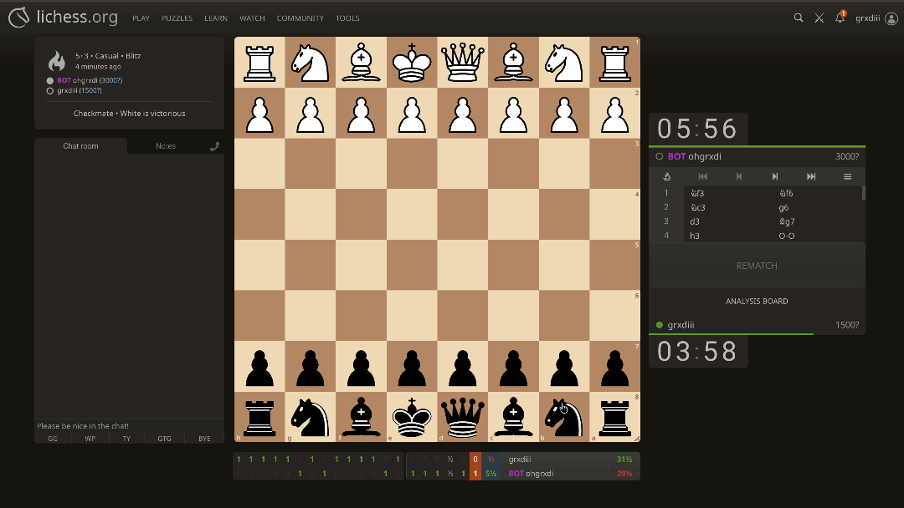

# ChessIT

This project aims to implement a simple chess engine that can be integrated into lichess. In order for it to run efficiently, I've chosen C++ as my development language.

<p align="center">
  
</p>

## Minimum Viable Product

Produces a fully functional chess engine that can communicate via UCI protocol and play complete games on the platform Lichess.

- [x] Legal move generation for all chess pieces.
  - Proper check detection
  - Bitboard based board representation
  - Full support for promotion, castling, en passant, and piece movements
- [x] Make and unmake moves.
- [ ] Basic search (in progres...)
  - Implement minimax tree with alpha-beta pruning
  - Fixed search depth (4 or 5)
- [x] Evaluation function
  - Material based evaluation
  - Standard piece value (eg. pawns == 100)
- [x] UCI Protocol Support
  - Correct handling of uci, isready, go, stop, quit
  - Outputs valid bestmove
  - Compatible with UCI GUIs and Lichess bot integration

## File Structure

```
├── /.venv
├── /build
├── /docs
├── /include
├── /src
├── /tests
├── .dockerignore
├── .env
├── .env.example
├── .gitignore
├── client.py
├── CMakeLists.txt
├── docker-compose.yml
├── docker-compose.prod.yml
├── Makefile
├── README.md
└── requirements.txt
```

## Getting started

### Installation

Clone repository:

```
git clone git@github.com:gradimbuyi/ChessIT.git
```

### Environment Variables

Create a `.env` file using the provided example:

.env.example

### Running with Docker

Build and start all services:

```
docker compose up --build
```

Stopping the application:

```
docker compose down -v
```
